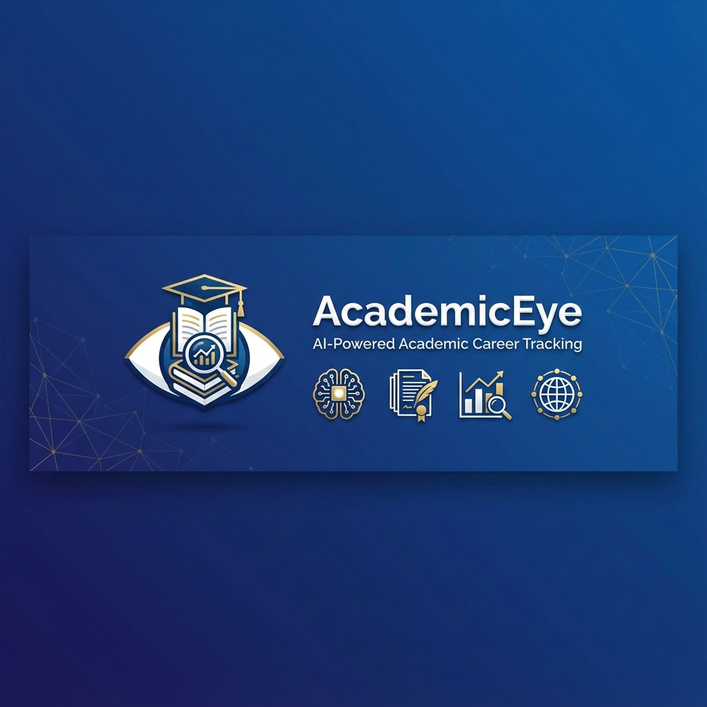

# AcademicEye - Intelligent Academic Career Tracking and Paper Recommendation Platform



[](https://www.python.org/downloads/)
[](https://flask.palletsprojects.com/)
[](LICENSE)
[](https://www.metu.edu.tr/)

**AcademicEye** is an AI-powered platform that helps academics track their career metrics, monitor publications across multiple databases, and receive personalized paper recommendations based on their research interests.

## Table of Contents

- [Features](#features)
- [Technology Stack](#technology-stack)
- [Installation](#installation)
- [Usage](#usage)
- [Architecture](#architecture)
- [API Integrations](#api-integrations)
- [Project Structure](#project-structure)
- [Contributing](#contributing)
- [License](#license)

## Features

### Intelligent Paper Recommendations
- **Multi-Source Aggregation**: Scrapes ArXiv and Semantic Scholar daily for new publications
- **Vector-Based Matching**: Uses semantic embeddings to match papers with user interests
- **Multi-Channel Delivery**: Sends recommendations via Telegram and WhatsApp
- **Full-Text Analysis**: Downloads and analyzes complete papers, not just abstracts
- **Audio Summaries**: Generates text-to-speech summaries in customizable styles
- **Interactive Q&A**: 30-minute window to ask questions about recommended papers using AI

### Academic Career Tracking
- **Multi-Platform Data Collection**:
  - Scopus API integration for publication metrics
  - Google Scholar profile scraping
  - YÖK (Turkish Higher Education Council) database scraping
  - IEEE Xplore integration

- **Intelligent Publication Comparison**:
  - Cross-platform publication matching (Scopus vs YÖK)
  - Fuzzy title matching with configurable thresholds
  - Detection of missing publications
  - Separation by publication type (articles vs conference papers)
  - Publisher-based grouping (IEEE, Springer, Elsevier, etc.)

- **Comprehensive Reporting**:
  - H-index tracking
  - Citation analysis
  - Publication statistics
  - Project tracking
  - Thesis supervision records

### Administrative Features
- **Department-Wide Reports**: Generate aggregate statistics for entire departments
- **Year-Based Filtering**: Analyze publications by specific years
- **National/International Classification**: Automatic categorization of publication scope
- **Faculty List Management**: Manual or automatic faculty roster compilation

### Web Platform
- **User Dashboard**: Personalized overview of career metrics and paper history
- **Mendeley Integration**: Automatic library synchronization via OAuth
- **Style Preferences**: Choose between casual, academic, or technical summary styles
- **Detail Levels**: Select short, medium, or detailed summaries
- **Publication Archive**: Complete history of all recommendations

## Technology Stack

### Backend
- **Framework**: Flask 2.0+
- **Database**: SQLite3 with WAL mode for concurrent access
- **AI/ML**: Google Gemini API for summarization and Q&A
- **Vector Database**: ChromaDB for semantic search
- **Web Scraping**: Selenium, BeautifulSoup4, undetected-chromedriver

### External APIs
- **Scopus API**: Publication data via Elsevier Developer Portal
- **Semantic Scholar**: Open-access academic paper database
- **ArXiv API**: Pre-print manuscripts and working papers
- **Google Scholar**: Profile and citation data
- **Mendeley OAuth**: Library management integration
- **WhatsApp Cloud API**: Business API for notifications
- **Telegram Bot API**: Interactive messaging and Q&A

### AI & NLP
- **Gemini 1.5 Flash**: Summary generation and conversational Q&A
- **Sentence Transformers**: Semantic embedding generation
- **gTTS**: Text-to-speech synthesis
- **pydub**: Audio file processing

### Frontend
- **Template Engine**: Jinja2
- **CSS Framework**: Bootstrap 5
- **JavaScript**: Vanilla JS with AJAX for dynamic content

## Installation

### Requirements
- Python 3.8 or higher
- Chrome/Chromium browser (for Selenium-based scrapers)
- FFmpeg (for audio processing)

### Step 1: Clone Repository
```bash
git clone https://github.com/YavuzSelimFit/AcademicEye-ODTU.git
cd AcademicEye
```

### Step 2: Create Virtual Environment
```bash
python -m venv venv
source venv/bin/activate  # Linux/Mac
# or
venv\Scripts\activate  # Windows
```

### Step 3: Install Dependencies
```bash
pip install -r requirements.txt
```

### Step 4: Configure Environment Variables
Create a `.env` file based on `.env.example`:
```env
# API Keys
GEMINI_API_KEY=your_gemini_api_key_here
SCOPUS_API_KEY=your_scopus_api_key_here

# Telegram Bot
TELEGRAM_BOT_TOKEN=your_telegram_bot_token
TELEGRAM_CHAT_ID=your_chat_id

# WhatsApp Business API
WHATSAPP_TOKEN=your_whatsapp_token
WHATSAPP_PHONE_ID=your_phone_number_id
WHATSAPP_VERIFY_TOKEN=your_webhook_verify_token

# Mendeley OAuth
MENDELEY_CLIENT_ID=your_mendeley_client_id
MENDELEY_CLIENT_SECRET=your_mendeley_client_secret
MENDELEY_REDIRECT_URI=http://localhost:5000/mendeley_callback

# Flask Secret
FLASK_SECRET_KEY=your_random_secret_key_here
```

### Step 5: Initialize Database
```bash
python database.py
```

### Step 6: Create Admin User
```bash
python scripts/create_admin.py
```

## Usage

### Running the Web Application
```bash
python app.py
```
Navigate to `http://localhost:5000` in your browser.

### Running the Telegram Bot
```bash
python academic_eye_bot.py
```

### Running the WhatsApp Bot
```bash
python whatsapp_eye_bot.py
```

### Executing Career Analysis
```bash
python scripts/kariyer_baslat.py
```

## Architecture

### System Flow Diagram

```
┌─────────────────┐
│      User       │
└────────┬────────┘
         │
    ┌────▼─────┐
    │ Web App  │◄────┐
    │  Flask   │     │
    └────┬─────┘     │
         │           │
    ┌────▼─────┐     │
    │ Database │     │
    │  SQLite  │     │
    └────┬─────┘     │
         │           │
┌────────▼─────────┐ │
│  Career Engine   │ │
│                  │ │
│ ┌──────────────┐ │ │
│ │ Scopus Bot   │ │ │
│ │ Scholar Bot  │ │ │
│ │ YÖK Bot      │ │ │
│ │ IEEE Bot     │ │ │
│ └──────────────┘ │ │
└──────────────────┘ │
                     │
┌────────────────────┴┐
│   Feed Engine       │
│                     │
│ ┌─────────────────┐ │
│ │ ArXiv Scraper   │ │
│ │ Semantic Scholar│ │
│ │ Vector Engine   │ │
│ │ PDF Processor   │ │
│ │ Summarizer      │ │
│ └─────────────────┘ │
└─────┬───────────────┘
      │
┌─────▼──────────┐
│ Notifications  │
│                │
│  - Telegram    │
│  - WhatsApp    │
└────────────────┘
```

### Module Organization

```
AcademicEye/
├── app.py                 # Main Flask application
├── database.py            # Database management
├── academic_eye_bot.py    # Telegram bot + paper scanner
├── whatsapp_eye_bot.py    # WhatsApp webhook bot
│
├── modules/
│   ├── feed_engine/       # Paper scraping and recommendations
│   │   ├── scraper.py     # ArXiv + Semantic Scholar
│   │   ├── processor.py   # Summary and category analysis
│   │   ├── vector_engine.py # Embedding and matching
│   │   ├── pdf_engine.py  # PDF text extraction
│   │   ├── audio.py       # Text-to-speech
│   │   ├── notifier.py    # Telegram notifications
│   │   └── whatsapp_notifier.py # WhatsApp messaging
│   │
│   └── career_engine/     # Career tracking system
│       ├── career_manager.py # Main analysis engine
│       ├── scopus_bot.py     # Scopus API client
│       ├── scholar_bot.py    # Google Scholar scraper
│       ├── yok_bot.py        # YÖK profile scraper
│       ├── ieee_bot.py       # IEEE Xplore scraper
│       └── google_search_bot.py # Verification
│
├── templates/             # HTML templates
│   ├── dashboard.html     # User panel
│   ├── mismatched_articles.html # Comparison page
│   └── admin_metu_eee_report.html # Admin reports
│
└── scripts/               # Utility scripts
    ├── create_admin.py    # Admin creation
    └── kariyer_baslat.py  # Batch analysis
```

## API Integrations

### Scopus API
```python
# Search for author
search_scopus_author_via_google("John Doe")

# Fetch publications
get_scopus_publications(scopus_id)

# Generate department report
get_department_report(
    faculty_list=['Author 1', 'Author 2'],
    year=2025,
    affiliation_id='60105072'
)
```

### ArXiv + Semantic Scholar
```python
# Scan by categories
get_latest_papers(
    interests_code="cs.AI,cs.LG",
    keywords_text="machine learning",
    limit=50
)
```

### YÖK Scraper
```python
# Profile scraping
yok_data = scrape_yok_profile(
    yok_id="000000",
    name="Prof. Dr. John Doe"
)
```

## Data Model

### User Table
- Basic information (name, email, password)
- Academic interests (ArXiv categories)
- Keywords
- Telegram/WhatsApp contact information
- Summary preferences (style, detail level)
- Admin status

### Profile Table
- Scopus ID
- Google Scholar ID
- YÖK ID
- IEEE ID
- H-index and citation count
- Publication counts (Scopus, YÖK)
- JSON-formatted analysis reports

### Paper History
- Title, URL, summary
- Full text (for 30-minute Q&A window)
- Telegram message ID (for reply tracking)
- Timestamp

### Projects
- Title, source (YÖK, etc.)
- Role (PI/Researcher)
- Year, status

## Known Issues and Solutions

### Scopus API Rate Limiting
- **Issue**: 3 requests per second limit
- **Solution**: Throttling with `time.sleep(0.4)`

### YÖK ID Resolution
- **Issue**: Name variations causing lookup failures
- **Solution**: Title cleaning and fuzzy matching

### PDF Download Errors
- **Issue**: Paywalled content
- **Solution**: Fallback to abstract-based summaries

## Contributing

Contributions are welcome. Please read [CONTRIBUTING.md](CONTRIBUTING.md) for guidelines on:
- Code style (PEP 8)
- Commit message format (Semantic Commits)
- Pull request process
- Testing requirements

## License

This project is licensed under the MIT License - see the [LICENSE](LICENSE) file for details.

## Developer

**Yavuz Selim Fit**
- GitHub: [@YavuzSelimFit](https://github.com/YavuzSelimFit)
- University: Middle East Technical University (METU)

## Acknowledgments

- Elsevier Scopus API
- Google Scholar
- ArXiv.org
- Semantic Scholar
- Turkish Council of Higher Education (YÖK)
- IEEE Xplore
- Google Gemini API

## References

- [Scopus API Documentation](https://dev.elsevier.com/)
- [ArXiv API](https://arxiv.org/help/api)
- [Semantic Scholar API](https://www.semanticscholar.org/product/api)
- [Telegram Bot API](https://core.telegram.org/bots/api)
- [WhatsApp Cloud API](https://developers.facebook.com/docs/whatsapp/cloud-api)
